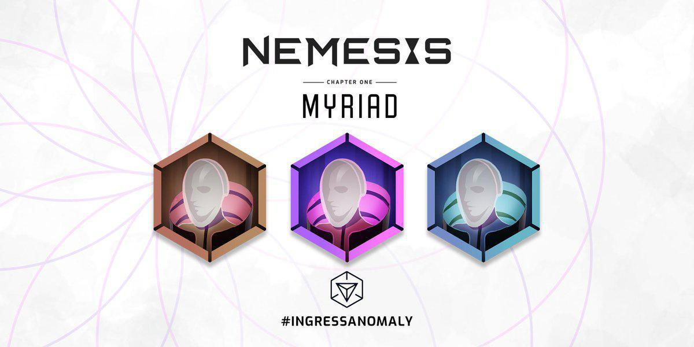
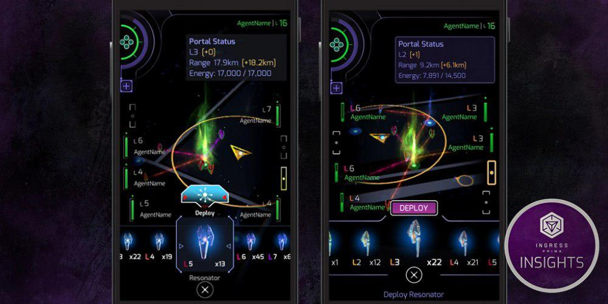
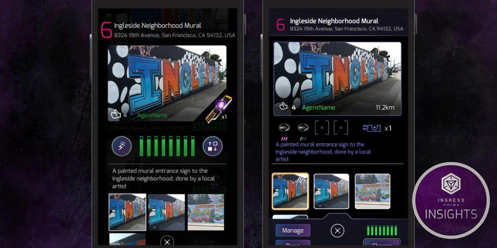
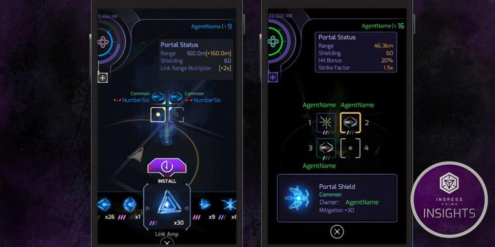
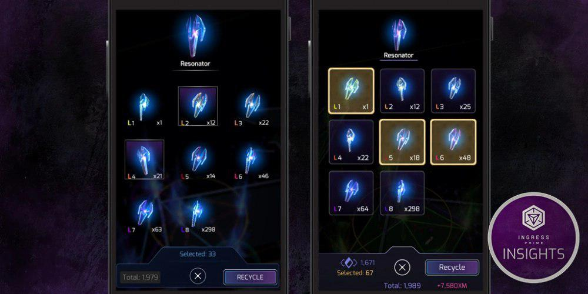
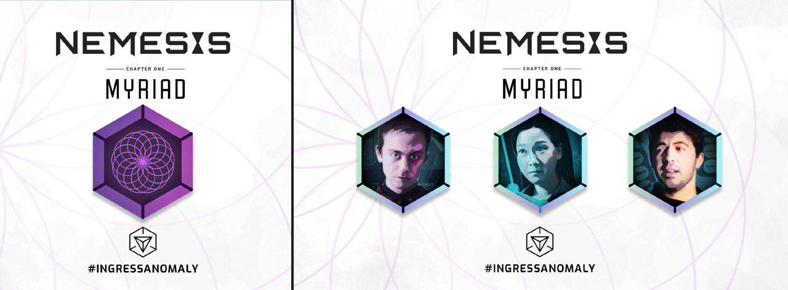
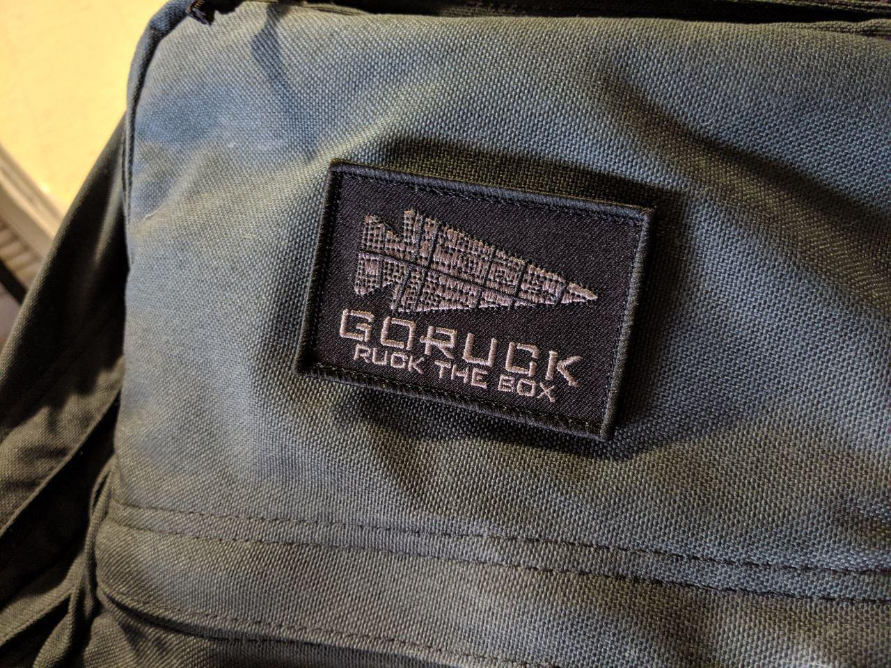

# 全新限时挑战Myriad Hack Challenge进行中
全新的全球活动正在进行中，这次的主题是UPH (Unique Portals Hacked，即hack不同的portal)。从东八区7月12日凌晨1时开始到7月23日凌晨1时期间，为迎接Myriad XMA，需要打通portal网络，特工需要尽可能多地入侵portal。

此次活动仅计算每位特工活动期间hack的不同portal的数量。即hack活动之前已经hack过的portal也会计数。

若活动期间全球每位特工的UPH加总数量达到1300万，则会有以下奖励：
1. 在活动期间积累的UPH计入一块新的限时游戏内奖章，该奖章分为100，350，750三个等级
2. 7月30日凌晨1时至8月8日凌晨1时期间，hack portal的冷却时间减至4分钟，hack或攻击敌方portal受到反击的伤害减少
3. 8月2日凌晨1时至8月6日凌晨1时期间，每位特工可以在每个portal上插L8与L7的脚各两支，L6与L5的脚各四支

若未达1300万，则在②对应时间内hack portal的冷却时间增至6分钟，hack或攻击敌方portal的伤害亦会增加。

截至发稿時，全球目标1300万已经达到，玩家只需继续UPH就可以解锁这次的限时奖章。

> 来源：https://community.ingress.com/en/discussion/2152/myriad-hack-challenge-july-11-22#latest 

# Scanner[REDACTED]将临时下线一天
老款客户端Scanner[REDACTED]将在东八区7月19日周五8时至7月20日周六8时期间临时下线，据称是因为Niantic需要做一些日常维护工作。新客户端Ingress Prime则不受影响。

> 来源：https://twitter.com/NianticHelp/status/1151288914973470725 

# Ingress Prime更新至2.27
近日Ingress Prime更新了2.26与2.27两个版本，主要内容是大幅度改进界面，改进交流平台与物品栏。
Niantic在一篇Ingress Insight帖子中有放出几张更新前后的界面对比图：

未来的话NIA表示会做以下内容：
1. 提高地图界面在阳光下的可视度
2. 用户界面更新阶段二
3. 客户端稳定性
4. Portal修改与举报功能
5. 继续除虫与实装老款Ingress原有的功能

> 来源：https://community.ingress.com/en/discussion/2131/ingress-prime-v-2-26-release-notes#latest https://community.ingress.com/en/discussion/2418/ingress-prime-v-2-27-release-notes#latest https://community.ingress.com/en/discussion/2416/ingress-insights-ui-pass-1 

# 第三季度XMA Myriad奖章与人物章设计公开
Niantic公布了将于7月27日举办的XM Anomaly Nemesis: Myriad的活动章及人头章设计。人头章可于 ingress.com/events 各比赛场地的注册页面内购买电子包获得。

> 来源：https://twitter.com/ingress/status/1151280490743308288?s=20 

# GORUCK新玩法：在XMA期间背着10磅负重走10公里
GORUCK宣布他们即将在韩国釜山与美国麦迪逊XMA上办一个新的小活动：Ruck the Box
参加XMA的玩家只要背着10-20磅负重，在XMA期间的3小时内步行超过10公里，即可找GORUCK教练领取Ruck the Box特制布贴一块。活动在开放报名后不久即告额满。

> 来源：https://t.me/gorucknews/117 
