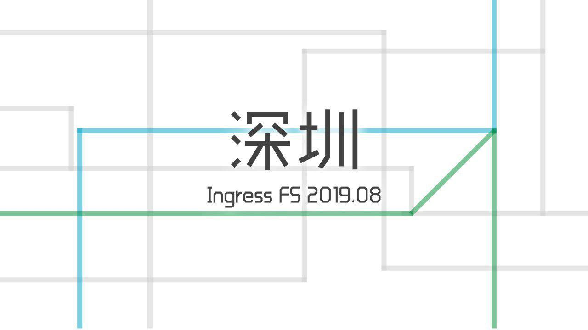
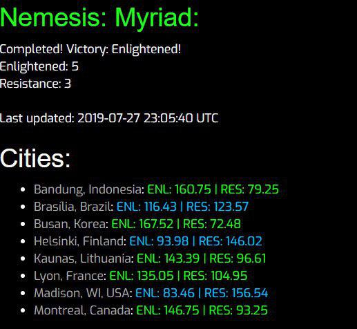
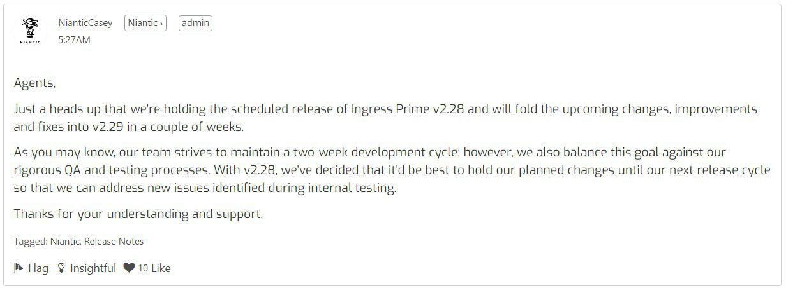
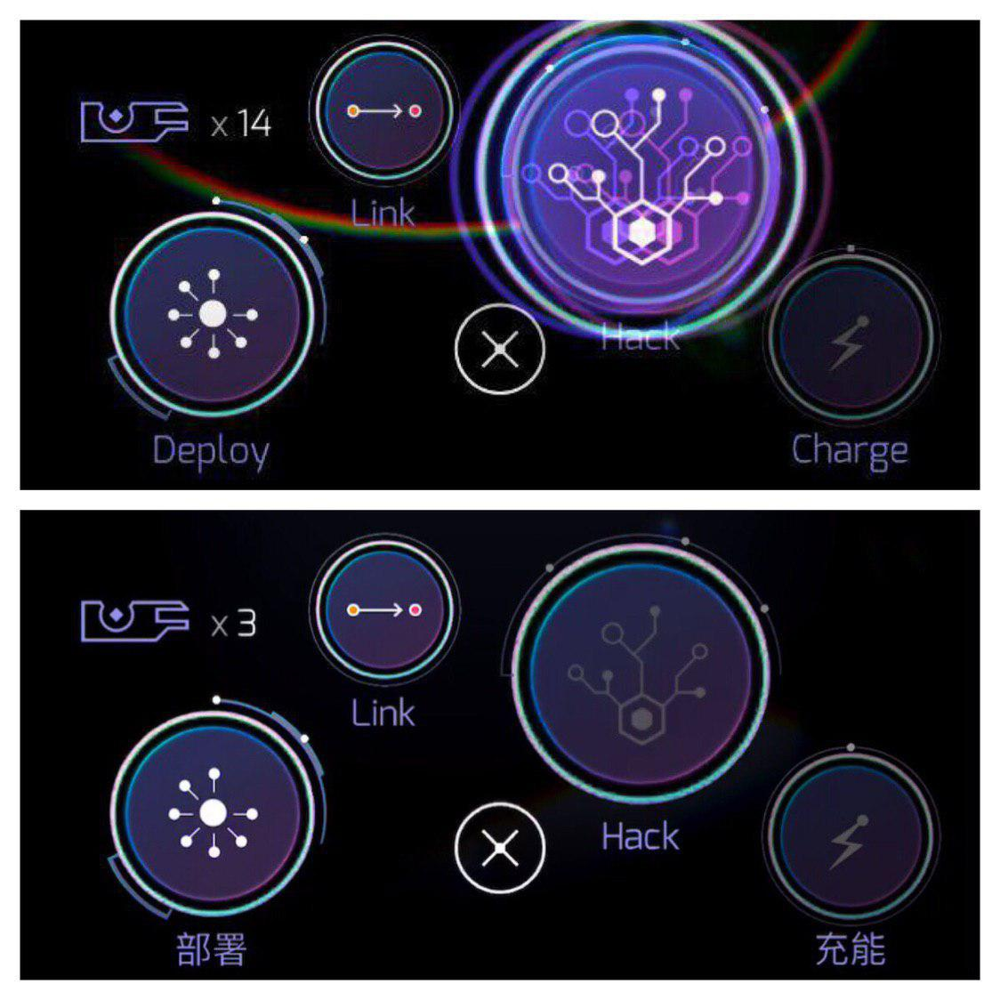
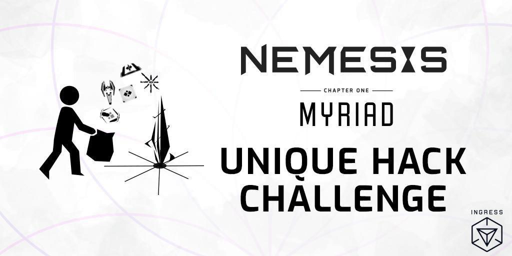
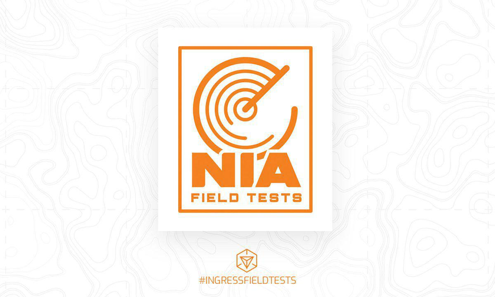

# 深圳8月IFS即将举行
2019年8月深圳 #IngressFS 即将在购物公园与东门步行街举办！

日期：2019 年 8 月 3 日

时间表：

- 17:00 开始签到
- 18:00 IFS 开始
- 20:00 IFS 结束，开始签退
- 20:30 补给 po 上线

购物公园场

- 地点：福田区COCO Park
- 活动报名链接：https://fevgames.net/ifs/event/?e=13502

东门场

- 地点：罗湖区东门步行街
- 活动报名链接：https://fevgames.net/ifs/event/?e=13501

聊天群组：@SZIFSChat

活动频道：@SZIFSChannel

# 启蒙军赢得第三季度Myriad XMA的胜利

经过一天的鏖战，启蒙军以5：3的总比分赢下了第三季度Myriad XMA。根据官方剧情，名为Myriad的威胁已经被打败，赢下了这季度XMA的启蒙军将在未来Nemesis系列XMA的总决赛上获得一项关键优势的优先选择权。

本次XMA使用的规则与上一季度相比有较大变更：
1. 这次的比赛项目只有碎片战、首尾相接长link与UPH三项，前两项各计100分（根据小分分配），UPH计40分（胜者全取）
2. 在某一场中胜利的阵营将可以得知一个该城市的强力补给portal的地点与上线时间
3. 胜出这一季度XMA的阵营将可以优先选择一项Myriad关键优势，其形式类似上一系列XMA中的战略武器，可在2020年的Nemesis XMA系列决赛中使用（落败阵营则在其后进行选择）

另外斯里兰卡XMA在两个月前宣布推迟，至今仍不知道会推迟到什么时候。但因为Myriad的总比分是5：3，所以斯里兰卡这一分也无法影响Myriad的结果了。

> 来源：https://storage.googleapis.com/ingress-internal-event-data/nemesis-myriad/score.html 

# Ingress Prime 2.28版更新被跳过

Niantic决定跳过Ingress Prime 2.28版更新，直接将更新内容顺延到2.29版中一起发布。
与2.24版更新顺延的情况类似，本次顺延也是因为Niantic在QA过程中发现了新的问题，需要更多时间修复。

> 来源：https://community.ingress.com/en/discussion/2777/update-on-2-28-release#latest

# Niantic禁用了2.27版Ingress Prime的按钮反馈特效

Niantic静悄悄地通过服务端更新移除了Ingress Prime 2.27版新增的按钮反馈特效，推测是因为有不少玩家在Ingress Community上表达了一定的负面意见。

# UPH限时活动奖励已上线

Unique Hack Challenge达成后的第一项限时奖励已激活，以下是未来数日内限时奖励的汇总：
1. 7月30日凌晨1时至8月8日凌晨1时期间，hack portal的冷却时间减至4分钟，hack或攻击敌方portal受到反击的伤害减少
2. 8月2日凌晨1时至8月6日凌晨1时期间，每位特工可以在每个portal上插L8与L7的脚各两支，L6与L5的脚各四支

# Ingress新活动Field Tests开放申请

前不久Niantic宣布要举办一种名为Field Tests的新活动，现在该活动的细节随着其申请链接一起公布了：
- 第一次Field Tests将在9月14日举行
- 申请将在8月12日截止，申请结果将在8月19日公布
- 申请需以城市为单位，蓝绿玩家一起申请更有可能获得通过
- 申请需要填写集合Portal链接，可以选择在申请中补充一个建议的游玩区域
- 活动本身持续60-180分钟，玩家需要先在出发点集合，然后根据随后会收到的指示进行比拼，8级或以上的玩家会更有优势（但是参加活动不需要到L8），活动过程中需要移动一定距离
- 暂时还不知道有没有章，以及是否允许大陆城市申请

> 来源：https://docs.google.com/forms/d/e/1FAIpQLSfhF7wrQ_WdyhnuWUMCl96ygpEvM87PR6f9FGew_zbfZG2ahQ/viewform

# Niantic修改了作弊玩家的惩罚机制

Niantic宣布将于未来数周内引入新的违规特工处分程序。如特工违反Niantic服务条款或Niantic玩家准则，将受到三阶段的处分：

1. 游戏内警告：将显示在侦测器 (Scanner) 中约七天，且须在继续Ingress前确认已明白此警告内容。再犯者将会受到第二阶段处分。

2. 暂时封禁：账户将被停用约三十天。处分结束后，特工会在侦测器中收到警告，需确认警告内容才能继续Ingress。

3. 永久封停：特工在受到第二阶段处分后仍然违反服务条款或玩家准则，账户将被永久封停。Niantic设有申诉机制重审被封停账户的处分，调查后会通知特工申诉结果。

此外，Niantic亦指出违反部分服务条款或玩家准则的特工将被禁用特工交流平台 (COMM) 或不作任何警告下永久封停。如特工对账户所受处分有所疑问，可查阅 Niantic支持 (https://niantic.helpshift.com/a/ingress/?s=your-ingress-account&f=why-was-my-account-terminated&l=en&p=web)。

如特工受到处分，需使用Ingress Prime阅读并确认处分内容及警告，同时将被禁用Scanner[REDACTED]。

> 来源：https://community.ingress.com/en/discussion/2618/upcoming-changes-to-policy-enforcement