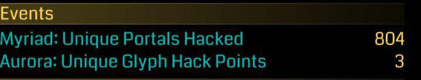
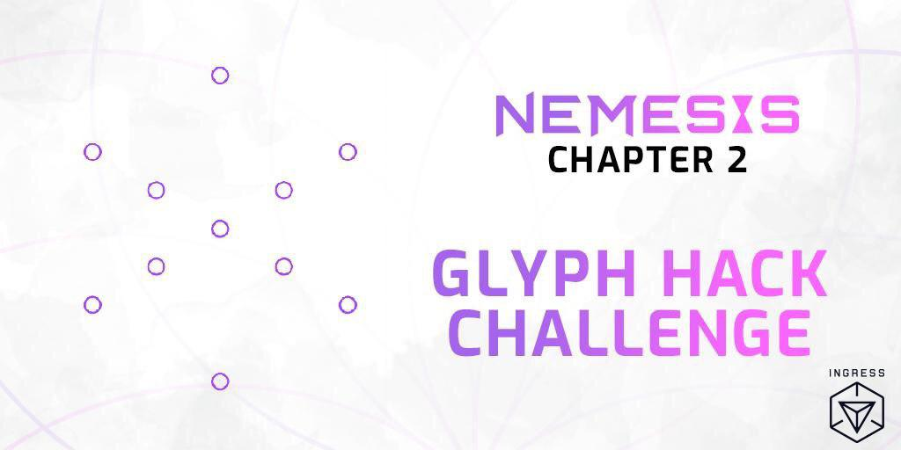
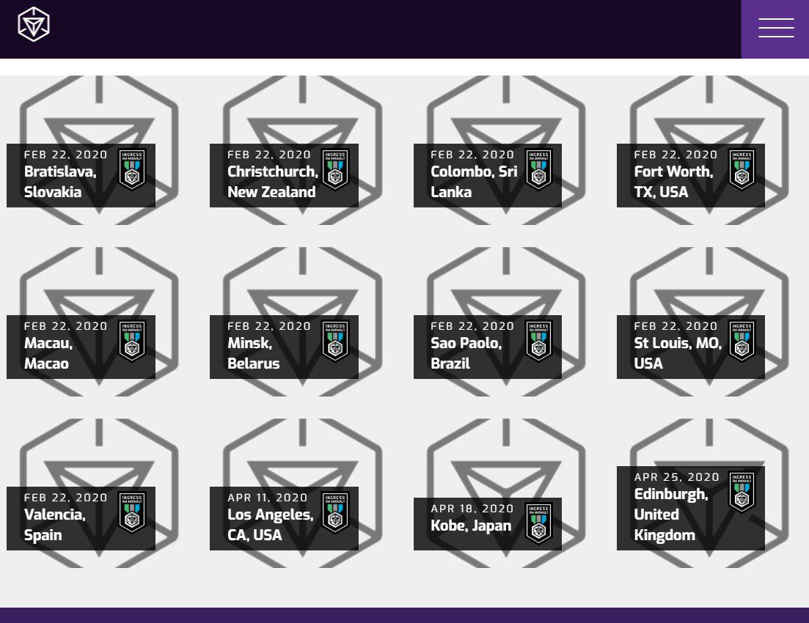
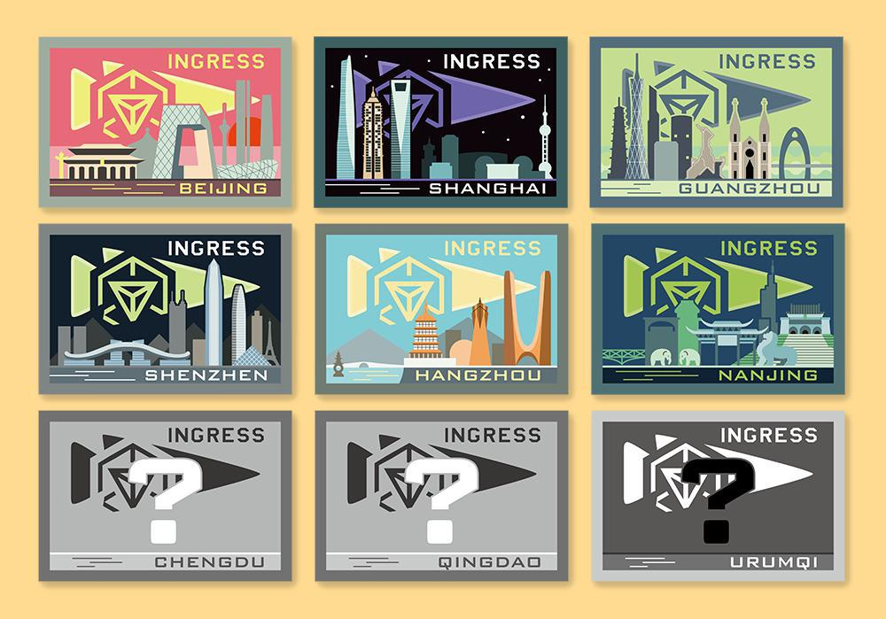
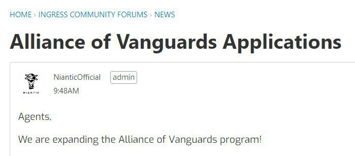
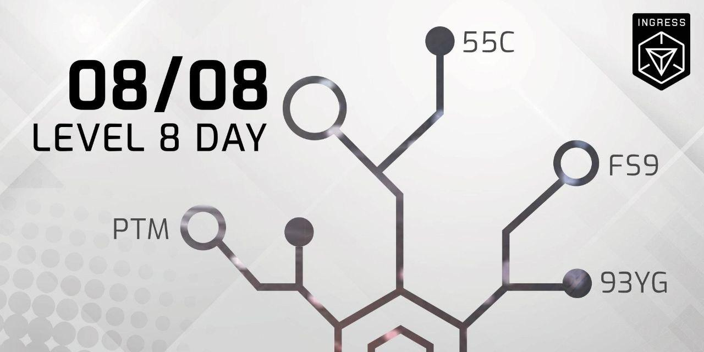

# 2019 W31-32 July 29 - Aug 14

## Nemesis 全球挑战第二弹！即将开始！

早前走漏风声的AURORA Glyph Hack Challange 终于放出具体的活动时间以及规则。

挑战时间（以下所有时间均为UTC+8）：  
8月16日凌晨1时 至 8月27日凌晨1时

全球目标：  
在规定时间内获得三千六百万 【Glyph Hack Sentence Point】。  
参与挑战的特工每获得【100】，【500】，或【1000】点数的时候将会获得相对应的成就奖章。

挑战成功奖励：  

- 由8月28日凌晨1时至9月5日凌晨1时，Glyph 入侵所获得的物品增加至正常情况下的1.33倍;
- 由8月29日凌晨1时至9月3日凌晨1时，Glyph 入侵所获得的AP增加至正常情况下的1.5倍。

挑战失败惩罚：

- 由8月28日凌晨1时至9月5日凌晨1时，Glyph 入侵所获得的物品减少33%。

具体规则：

- 每位特工入侵某一Portal时，针对不同长度的 Glyph 语句，每【首次】正确绘制，得到1点。
- 若该特工首次尝试失败，尽管下次入侵时绘制正确，该语句长度仍不得分。
- 在同个Portal上成功绘制 一~五图 的Glyph 语句，最多可获得5点点数。

官方示例：

1. 特工A在Portal A上成功画了一图，得1点。
2. 特工A升级Portal A，成功画了二图，得1点。
3. 特工A又升级Portal，尝试画三图，失败，不得分。特工A再次尝试，成功，依旧不得分。
4. 特工A和小伙伴再度升级Portal，尝试画四图，成功，得1点。
5. Portal被升级到8级，特工A尝试画五图，成功，得1点。
6. 特工A在Portal A上获得的最终点数为4点。特工A若不出错，最大可以获得5点点数。

注1：上周有玩家发现自己的个人页面多了一项神秘的活动计数。从字面意义上猜测，本项计数应该是记录在不同的portal上画图的得分。然而该计数在出现后半小时内就消失了，看来是活动代码偷跑。  
注2：在8月IFS中玩家可以hack到名为ultiaurora的媒体，和本活动名称中的Aurora命名类似，可能剧情上有相关。

> 来源：<https://community.ingress.com/en/discussion/3187/aurora-glyph-hack-challenge>

---

## Niantic意外泄露了2020年前两个季度XMA活动的日程表初稿

今天凌晨Niantic官网上公开了2020年前两个季度的XMA活动日程表，然而在不久后又撤下了。全球社群经理Andrew Krug称这些XMA活动是错误被上架的，他们的确考虑在名单中的一些城市里举办未来的XMA，但是这个名单极有可能还会发生变化。他表示确定版名单会在不久后公布。

至于日程表里有什么城市以及是什么时间，可以参考以下的列表：

2020年2月22日  
欧洲  
布拉迪斯拉发，斯洛伐克  
明斯克，白俄罗斯  
瓦伦西亚，西班牙  

亚洲以及大洋洲  
澳门  
基督城，新西兰  
哥伦布，斯里兰卡  

美洲  
沃斯堡，德克萨斯州，美国  
圣保罗，巴西  
圣路易斯，密苏里州，美国  

2020年4月11日
洛杉矶 加利福尼亚，美国

2020年4月18日
神户，日本

2020年4月25日
爱丁堡，英国

> 来源：<https://ingress.com/events>

---

## 城市布贴周边正在征集购买意向

上海友军设计的布贴周边正在征集购买意向，其中有以深圳地标为灵感设计的深圳款！欢迎大家点击来源链接为自己喜欢的布贴款式+1！

> 来源：<https://docs.google.com/forms/d/e/1FAIpQLSdHtLIoVYubKTG5Y70R_fEFMzDPTMlZ7jXhzbeFUNO_QNgo-g/viewform>

---

## 先锋计划扩招

两年前Niantic发布了玩家大使计划（又称先锋计划），招募了20余位玩家作为官方与玩家群体之间沟通交流的桥梁。如今Niantic决定将先锋人数从24人扩招到36人，加上原先锋中有数位玩家决定退休，也就是说有将有十几个先锋名额开放给大家申请。有兴趣的玩家可以点击来源链接了解一下。

> 来源：<https://community.ingress.com/en/discussion/2952/alliance-of-vanguards-applications>

---

## 庆祝Ingress级八节，享受短暂的双倍AP

为庆祝级八节（LEVEL 8 DAY），官方推出了双倍AP活动。
活动时间为东八区8月8日上午8时至8月10日上午8时。

> 来源：<https://t.me/IngressChinese/284>

---

## Andrew分享了有关Ingress Prime未来会进行的若干点更新

Andrew在IUENG的讨论群里分享了有关Ingress Prime的三件小事：

1. Niantic近期将启动一项Ingress Prime Beta测试项目，将挑选一小群提前测试Ingress Prime的更新以获得反馈
2. 下一次Ingress Prime UI更新将允许玩家设置屏幕对比度，以在阳光直射环境下提供更好的UI可读性
3. 下一个Ingress Prime版本加载速度会更快

> 来源：<https://t.me/IUENG/4722>
