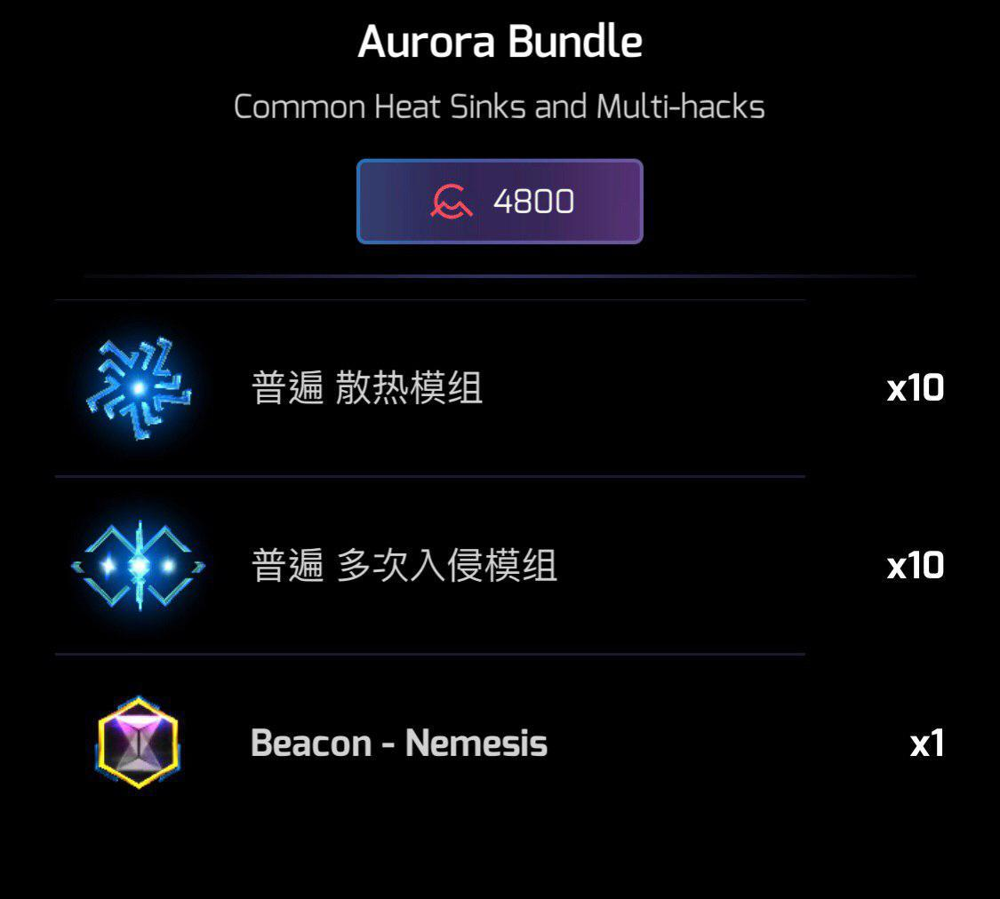

# 2019 W31-32 Aug 15 - Aug 27

## Ingress新活动Field Tests申请结果公布，澳门即将举办珠三角第一次Field Tests活动

前不久接受申请的9月14日Field Tests活动申请结果已经公布，珠三角内有一个地方的申请被通过了：澳门！

推文同时公开了以下信息：

- 具体开始地点，时间与报名链接有待进一步公开
- 规则会在活动开始前一小段时间才公布
- 规则主要比拼个人活动而不是阵营活动
- 参加者有章

本次Field Tests举办城市列表可以参考来源链接。

> 来源：<https://community.ingress.com/en/discussion/3374/field-test-cities-for-2019-09-14>

---

## Aurora Glyph Hack Challenge 全球挑战失败，画图产出即将临时下调33%

今年第二个全球挑战活动Aurora Glyph Challenge已经结束，全球玩家仅达成挑战目标三千六百万点中的49%，并没有完成全球挑战的目标。根据活动前公布的活动规则，挑战失败后会有惩罚效果，具体如下：

- 由8月28日凌晨1时至9月5日凌晨1时，画图入侵所获得的物资减少33%。

令人安心的是，本次活动规则里并未提及要达成目标才会有奖章，所以已经刷满100/500/1000点的玩家大可放心，牌子是不会被没收的。

> 来源：<https://t.me/IETodayJpn/1118>

---

## 第四季度XMA Umbra的logo已公布

Niantic在推特上公布了今年第四季度XMA Umbra的logo，如无意外10月份就可以在游戏内看到这块成就牌。

注1：Umbra是Nemesis系列第二场XMA，不知道为何海报上写着“第五章”，有可能是还有两场别的全球活动  
注2：深绿即将在10月12日举办本次XMA的充电房，有意参加可以在Telegram内联系@ReznovHuang

> 来源：<https://twitter.com/ingress/status/1163971498463367168?s=21>

---

## Aurora游戏道具包贩卖中，薯条加价100%

Niantic在Aurora画图活动的前夕在游戏内商店上架了一个氪金道具包，内含：

- 普通等级的散热模组与多次入侵模组各10个
- Nemesis信标1个

与此同时有眼尖的玩家发现Niantic悄然将能量塔压裂器（俗称薯条）的价格提高了一倍，官方论坛上大量玩家表达了不满，不过官方似乎没有回调的意思。

