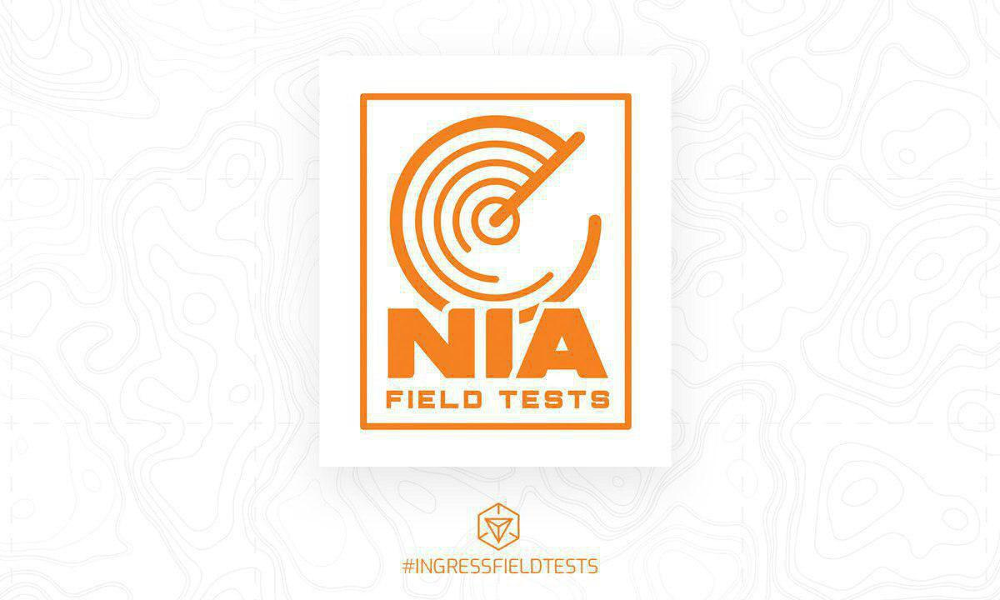
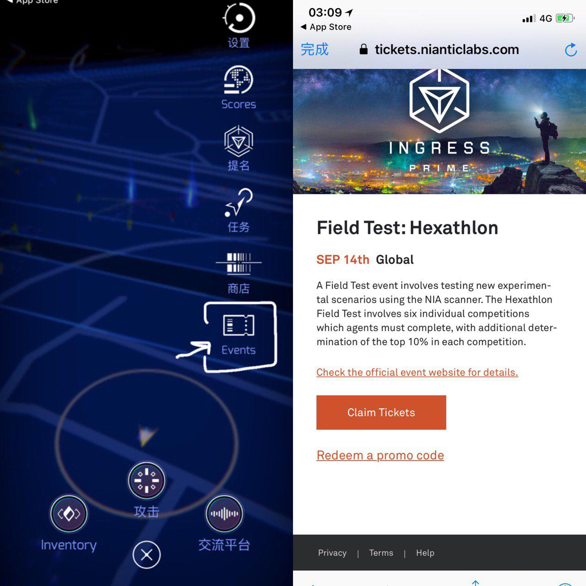
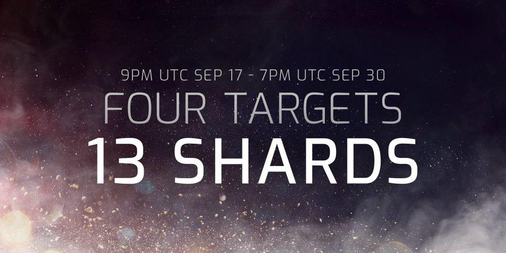
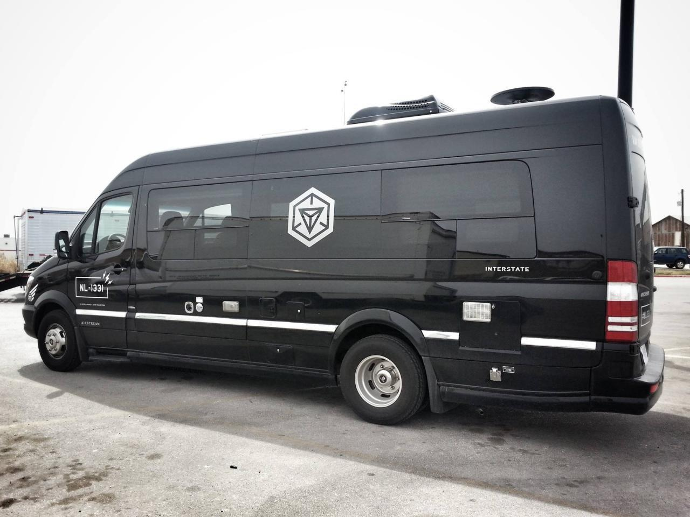
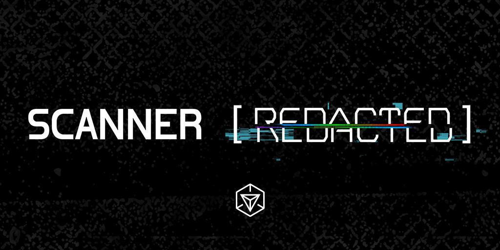
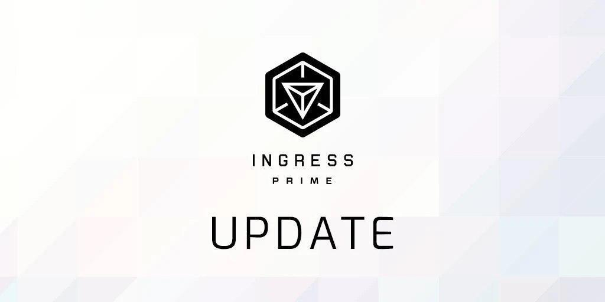
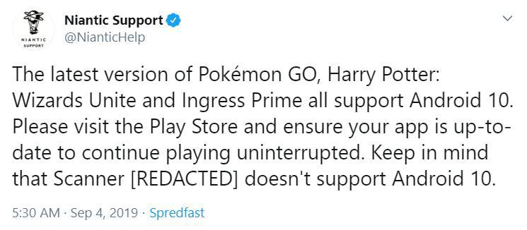
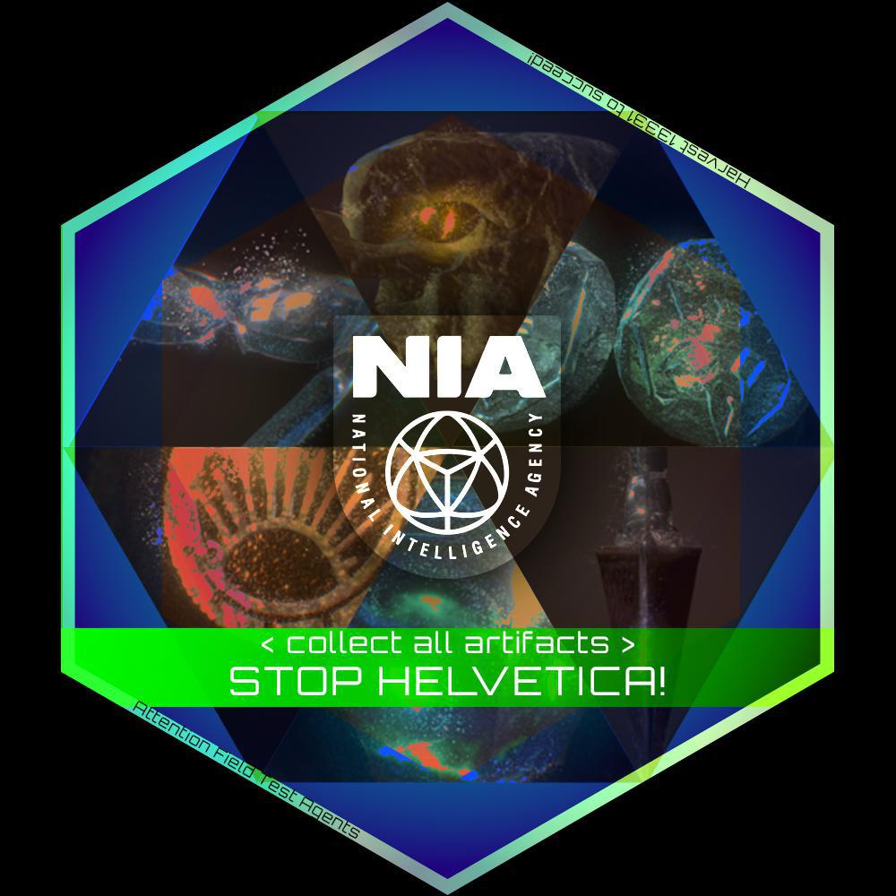
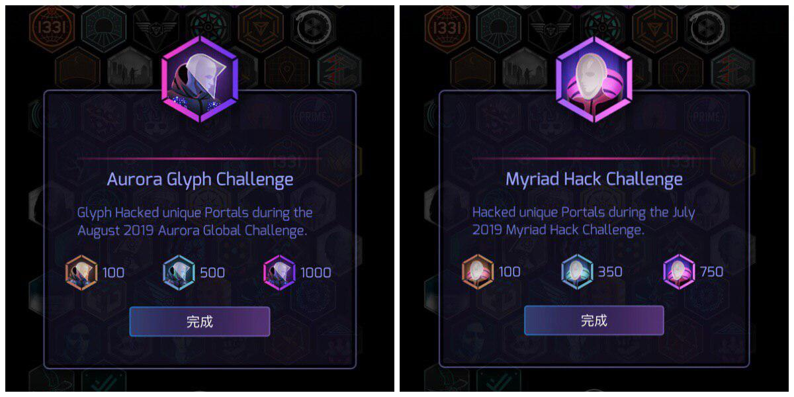

# 2019 W35-36 Aug 28 - Sep 11

## NIA Field Test: Hexathlon 活动细节公开，并已开放注册

Niantic公开了有关即将在9月14日举办的FieldTests活动的一些细节：

- 本次活动名称为Hexathlon（六项全能）
- 这次活动的主要目的是测试新Scanner互动，出错很正常（推测要用Ingress Prime进行）
- 活动前有30分钟注册时间，玩家需要hack注册Portal以参加，hack后会收到后续挑战的具体信息
- 注册完成后玩家需要在90分钟内完成六项挑战
- 按时完成六项挑战的玩家将获得活动奖章
- 在任何一项挑战中取得城市前10%成绩的玩家获得的活动奖章将升级为精英版
- 活动基于个人而非阵营，所以没有阵营POC
- 需要提前在线注册

下附活动时间表（本地时间）：

- 14:30 注册Portal上线
- 15:00 注册Portal下线
- 15:15 活动开始
- 16:45 活动结束
- 往后就由当地社群安排了

距离深圳最近的场次是澳门场，有兴趣参加的朋友可以查看活动频道 @macauFT 了解更多资讯。

本活动报名已开始，活动名额有限，并将在北京时间9月13日7時59分关闭报名。想参加的玩家请务必使用2.30或更新版的Ingress Prime在游戏内点击Events报名。

> 来源：<https://ingress.com/eventdescription/hexathlon-20190914>

---

## Avenir全球碎片活动即将到来

Nemesis系列全球活动的下一场即将到来：跨阵营合作全球碎片活动！
从9月18日开始到10月1日，13颗Avenir碎片将陆续出现在全球Portal网络中，蓝绿阵营玩家需要合作将这些碎片运输到4个目标Portal中的任意一个。

具体时间表如下（北京时间）：

- 9月18日5时：碎片目标出现，3颗碎片出现
- 9月20日未知时刻：额外4颗碎片出现
- 9月24日未知时刻：额外3颗碎片出现
- 9月27日未知时刻：最后3颗碎片出现
- 10月1日1时：碎片进行最后一次跳跃

碎片跳跃规则：

- 碎片与碎片目标不与阵营绑定，蓝绿阵营需要合作进行hack key、清障、物流等工作来达成目标
- 碎片每5小时沿着link跳跃一次
- 碎片跳跃要求link两端Portal都达到L4或以上，并会在满足条件的link中随机挑选一条
- 碎片可以沿着上一次跳跃的link往回跳
- 碎片到达目标后就不再跳跃

为了达成阻止剧情反派Avenir的目的，玩家需要将最少7颗碎片送到目标。根据成功送到目标的碎片数量，会有以下全球奖励：

- 7-9颗碎片：在这14天内hack过任意一个Portal的玩家获得Avenir奖章
- 10-12颗碎片：以上奖励，增加1.5倍毒掉率及Portal掉电速度减半
- 13颗碎片：以上奖励，Portal掉电速度进一步降低到25%

如果送到目标的碎片少于7颗，将会有以下惩罚：

- 1-6颗碎片：Portal掉电速度增加50%
- 0颗碎片：Portal掉电速度增加75%

这些全球奖励或惩罚会在北京时间10月4日1时 - 10月11日1时期间生效，为期一周。

祝大家好运！

> 来源：<https://community.ingress.com/en/discussion/4045/avenir-shard-event/>

---

## NL1331亚洲活动日程公开，即将到访澳门

NL1331即将久违地来到亚洲展开活动，以下是具体日程：

- 10月5日 首尔
- 10月10日 基隆
- 10月12日 桃园
- 10月15日 嘉义
- 10月17日 屏东
- 10月20日 澳门

这将是NL1331第一次来到珠三角城市，想要开牌的朋友请务必抓紧机会！

> 来源：<https://ingress.com/events>

---

## Scanner\[REDACTED\]将在2019年9月30日退役

Niantic官方确认经典款Ingress客户端Scanner\[REDACTED\]将在2019年9月30日退役。

> 来源：<https://www.twitter.com/Ingress/status/1167232992361754625>

---

## Ingress Prime更新至2.31

近日Ingress Prime进行了2.30与2.31两次更新。2.30添加了游戏内报名参加活动的功能，而2.31则是一个大更新，进行了大量界面微调，并实装了以下新功能：

1. Portal编辑与举报
2. 长按Portal进行hack操作
3. 导出玩家数据
4. 导出Portal地点
5. 轻触反馈

具体更新日志可以参考此链接：<https://telegra.ph/Ingress-Prime-2312%E6%9B%B4%E6%96%B0%E6%97%A5%E5%BF%97-09-10>

> 来源：<https://community.ingress.com/en/discussion/4004/ingress-prime-2-31-2-release-notes>

---

## 在Android 10上运行Scanner[REDACTED]有机会暂时封号

Niantic通过推特提醒大家：最新版的Ingress Prime已经支持Android 10，但是老旧的Scanner\[REDACTED\]并不支持。在Android 10上运行Scanner\[REDACTED\]有机会导致账号被暂时封禁。如果不幸遭遇此情况，请在官方帮助平台申诉解封账号。

> 来源：<https://twitter.com/NianticHelp/status/1168999635849031681>

---

## 新剧情media出现，内容直指新活动FieldTest

一份新的media近日出现在了Portal网络里。Media内容称，Nemesis（反派NPC组织）中的一位名为Helvetica的特工将会在我们的世界中召唤若干份神器来达到某个不为人知的目的。为了阻止他，玩家需要在即将到来的FieldTest活动中一起收集13331份神器。

> 来源：<https://community.ingress.com/en/discussion/3996/helvetica-and-prime-artifacts/>

---

## Aurora画图挑战与Myriad UPH挑战的奖章计数已被隐藏

近期的限时挑战：Aurora画图挑战与Myriad UPH挑战的奖章计数已被隐藏。

---

## 八月的猩猩社群经理Andrew Krug的问答栏目回答已放出

八月的猩猩社群经理Andrew Krug的问答栏目回答已放出，以下是内容精选：

Ingress客户端相关

- Ingress Prime将于Scanner\[REDACTED\]退役前实装Portal导航、Portal编辑与个人数据分享功能（后两项已在2.31版实装）
- Ingress Prime将在短期内实装“将Portal位置复制到粘贴板”这个功能（已在2.31版实装）
- Ingress Prime用户界面更新阶段二也会在短期内实装，可能会在下个版本更新2.31。这个更新基于用户反馈做了相当多的改变。
- 官方数据显示日常使用Ingress Prime的用户多于使用Scanner\[REDACTED\]的用户
- Niantic已经在研究如何应对苹果设备的“所有可以使用社交媒体账号登录的软件都需要加入使用Apple ID登录功能”的新政策
- Niantic接下来会着重处理Ingress Prime使用内存过多的问题（一个表现是切到其他App再回到Ingress Prime時Prime要重新启动）

活动相关

- Umbra XMA与Myriad XMA在实体周边的安排上应该不会有区别（也就是说还是没有实体周边包）
- 9月还会有全球活动

Portal申请与OPR相关

- Niantic最早会在下周开始在Portal申请被拒邮件里加上拒绝理由
- 如果在OPR里见到虚假Portal申请，可以截图拿去帮助中心举报，不过要记得最后要给个1分

NIA OPS相关

- 多次恶意申请Portal的玩家会受到惩罚，惩罚形式包括：无法再申请Portal、无法再使用OPR、永久封禁账号。上述惩罚都已经被实施过

> 来源：<https://community.ingress.com/en/discussion/3642/august-ama-questions-and-answers>
