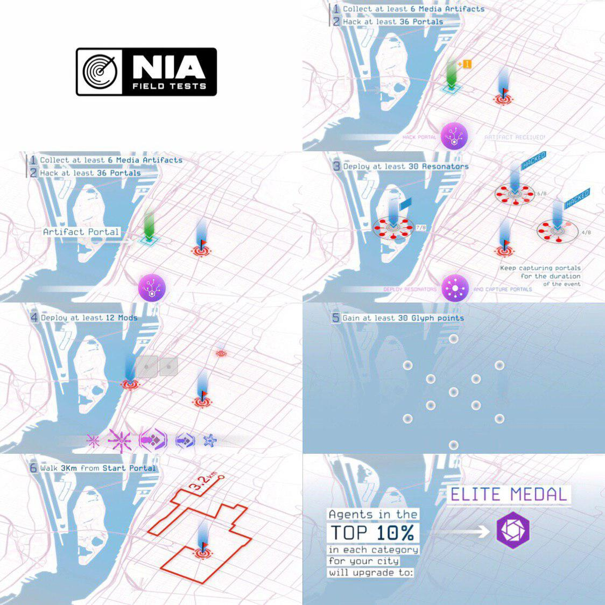
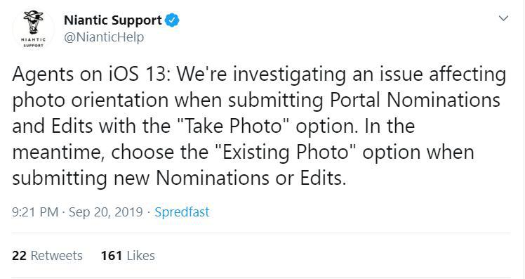

# 2019 W37-40 Sep 12 - Oct 7

## Scanner[REDACTED] 已正式关停

Ingress 1.0客户端最后的余光——Scanner[REDACTED]已于2019年10月1日1時正式关停。现在只能使用新版客户端Ingress Prime进行游戏了。

---

## 第四季度XMA Umbra开放注册

今年第四季度XMA Umbra所有场次已开放注册。与以往所有的XMA不同，这次XMA不再提供免费参加并可拿章的选项。无论是到场参加，还是远程支援，都需要通过Ingress Prime的活动注册页面购买参加对应的门票：

现场参加（15美金+税）（买一送二）：

- XMA期间获得2倍AP奖励
- 获得Umbra游戏内奖章（需要在XMA期间hack 13个战场portal才会派发）
- 计入XMA阵营得分
- 赛后获得个人成绩单并计入现场参加排行榜
- 付费购买此门票者可获得两份现场参加门票兑换码，可以给其他人使用，包含以上奖励

现场参加（免费）：

- 计入XMA阵营得分

远程支援（15美金+税）：

- XMA期间获得2倍AP奖励
- 获得Umbra游戏内奖章（需要进行充电/解码/Intel支援才会派发）
- 赛后获得个人成绩单并计入远程支援排行榜

注1：活动页面付款只支持使用信用卡付款，而且因为要用自己的游戏客户端注册，所以找别人付款有一定困难，想要充电拿章但是没有信用卡的朋友可能要想想办法了。  
注2：本来门票只有两个付费选项，且没有现场门票买一送二的福利。然而这条消息激发了玩家群体极大的不满，Niantic才加上了免费现场门票和买一送二。

> 来源：<https://community.ingress.com/en/discussion/4143/umbra-registration-now-open>

---

## Avenir全球碎片活动已结束，共有12颗碎片到达目标

持续两周的Avenir全球碎片活动已结束，共有12颗碎片到达位于美国、台湾与巴拉圭的目标Portal，1颗碎片滞留白俄罗斯。根据活动规则，玩家会获得以下奖励：

- 在碎片活动期间hack过任意一个Portal的玩家获得Avenir奖章
- 东八区10月4日1时 - 10月11日1时之间，Jarvis Virus与ADA Refactor的掉率临时增加1.5倍，Portal掉电速度减半

> 来源：<https://carlobolla.xyz/shards/>

---

## NL1331澳门场开放注册，周边包内含香港1331金属章

即将于10月20日在澳门举办的NL1331活动已开放注册，周边包的内容物也公布了。实体周边依然是那些，不过有趣的是里面的1331金属章是香港的，看来本来是想驶去香港？

> 来源：<https://events.ingress.com/NL1331/Macau2019>

---

## NIA Field Test: Hexathlon 活动结束，奖章已派发

第一次Field Test活动已结束，奖章已派发，以下是取得基本奖章的条件：

1. 从标记Portal处收集最少6个媒体
2. Hack最少36个Portal
3. 部署最少30只共振器
4. 部署最少12个mod
5. 获得最少30点画图分
6. 从起始Portal开始步行最少3公里

这六项挑战可以按任意顺序完成，完成所有六项挑战并在任意一项挑战中获得前10%的成绩即可获得精英奖章。

根据不完全统计，本次活动中有19位深绿玩家完成挑战获得奖章，其中更是有14位玩家取得前10%的成绩，赢得了精英奖章！

> 来源：<https://www.youtube.com/watch?v=CL5svFb233I>

---

## Ingress Prime更新至2.33

近日Ingress Prime进行了2.32与2.33两次更新，内容均为一些除错与界面微调。

具体更新日志可以参考以下链接：  
2.32 <https://telegra.ph/Ingress-Prime-2322%E6%9B%B4%E6%96%B0%E6%97%A5%E5%BF%97-09-25>  
2.33 <https://telegra.ph/Ingress-Prime-2331%E6%9B%B4%E6%96%B0%E6%97%A5%E5%BF%97-10-04>

> 来源：<https://community.ingress.com/en/discussion/5036/ingress-prime-2-33-1-release-notes>

---

## Umbra XMA电子人头章礼包因为BUG延迟发售

Niantic制作人Brian Rose表示，因为BUG的缘故，本次XMA的电子人头章礼包暂时未能上架游戏内商城。开发团队将尽力在XMA开始前修复问题并上架礼包。作为补偿，礼包售卖期将延续到XMA结束之后。

---

## Portal提名拒绝邮件现包含拒绝理由

根据IUENG的推送，Portal提名被拒绝的通知邮件新增了拒绝理由。暂时报料人观察到以下拒绝理由（由原英文推送翻译而来，推测中文邮件里会有中文的理由）：

- 没有充足证据表明申请地点准确地定位在申请对象的真实地点上
- 申请的真实地点看起来是普通商户或餐厅
- 申请对象是季节性的展示物，或并非永久陈设

> 来源：<https://t.me/IUENG/4781>

---

## iOS 13下Ingress Prime拍照申po，照片朝向会出错

请各位使用iOS 13的玩家注意，官方确认运行在iOS 13的Ingress Prime在拍摄照片申请Portal的时候照片朝向会有问题，请各位在官方修复该问题前使用相册照片申请Portal。

> 来源：<https://twitter.com/NianticHelp/status/1175037183645966336>

---

## Nemesis剧情系列将有13章节，现在进行到第五章

Niantic更新了Ingress的Facebook主页封面，换成了题图这一张。上面有Nemesis的logo与13位Nemesis的人物，其中包括剧情已经进行完的Myriad（XMA与UPH挑战）、Aurora（画图挑战）、Avenir（全球碎片）与Helvetica（FieldTest）以及即将到来的Umbra（XMA），余下的8位则依然是黑脸状态。

考虑到Umbra后可能还有两季XMA，余下8位未露头的Nemesis人物中的6位可能会继续以全球活动的形式登场，最后将对应的套套人头章推送到玩家个人页面上？

> 来源：<https://www.facebook.com/Ingress/>
