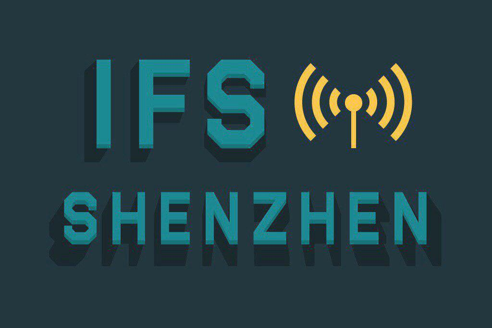
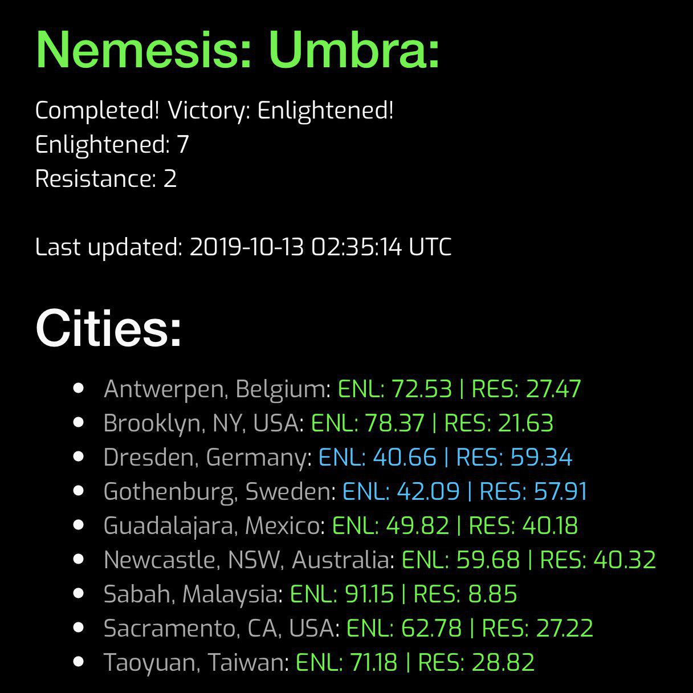
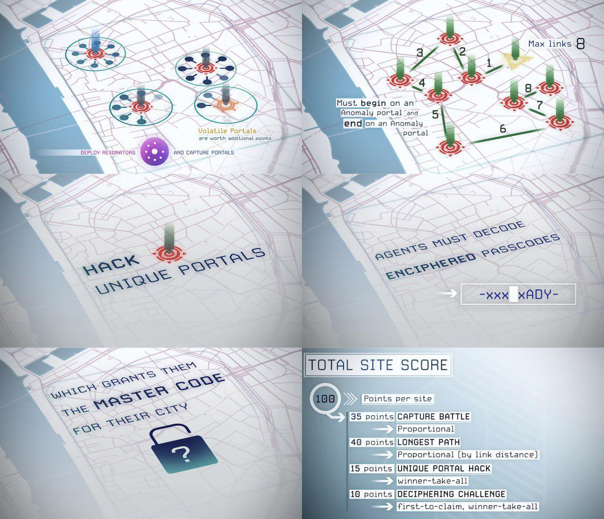
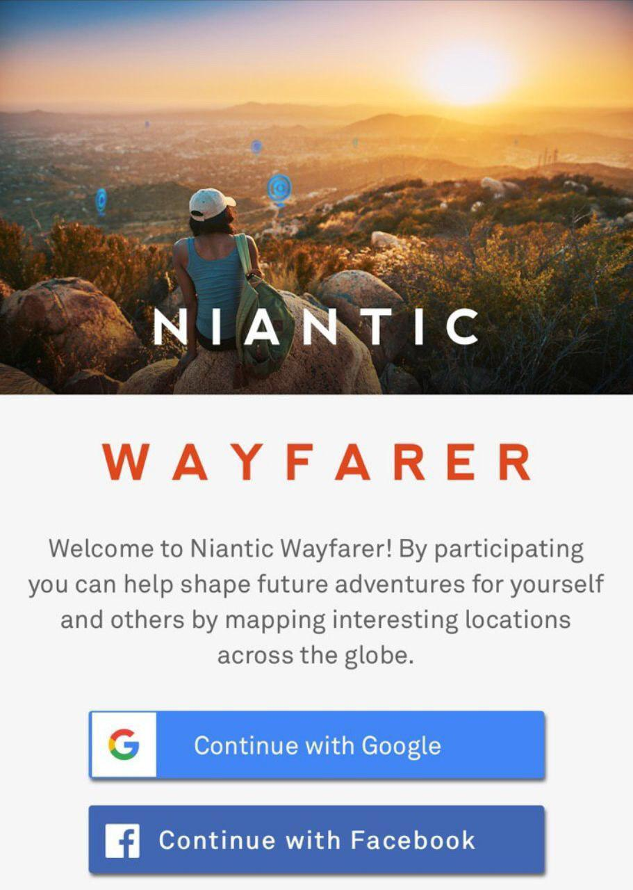
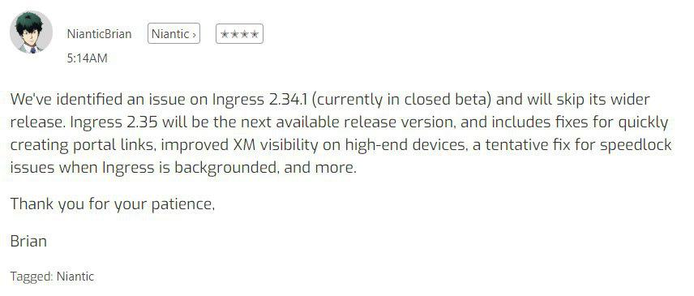
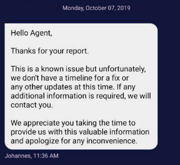
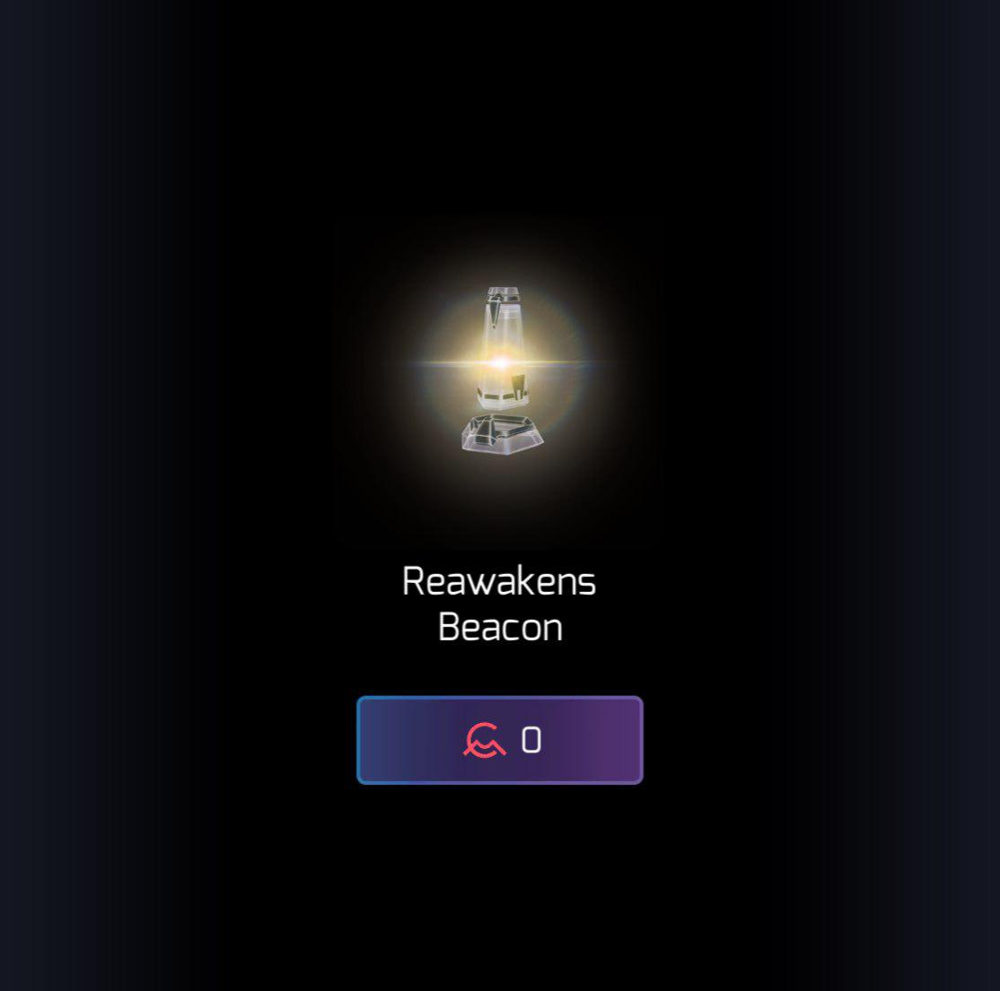

# 2019 W41-43 Oct 8 - Oct 28

## 深圳11月IFS即将举行

2019年11月深圳 #IngressFS 即将在福田区下沙文化广场举办！

日期：2019 年 11 月 2 日

时间表：

- 14:30 开始签到
- 15:30 IFS 开始
- 17:30 IFS 结束，开始签退
- 18:00 补给 po 上线

地点：下沙文化广场（近地铁下沙站）  
活动报名链接：<https://fevgames.net/ifs/event/?e=14703>

聊天群组：@SZIFSChat  
活动频道：@SZIFSChannel

---

## Umbra XMA结束，启蒙军以7：2的比分获得总胜利

在刚刚结束的Umbra XMA中，启蒙军在美洲与亚洲大获全胜，赢下了9个场次中的7个，以7:2的总比分获得了这一季度XMA的总胜利。根据规则，启蒙军将可以优先选择在未来的Nemesis决战中使用的Umbra关键优势。

在这次XMA中，Niantic在常规的占领Portal、连link长龙与hack不同的Portal三项挑战外，新增了一项有关解码的挑战。XMA开始时所有参战玩家都收到了含有大量密码的邮件，这些密码解密后可以在游戏内兑换。当一个阵营成功解出其中75%的密码时，该阵营所有参战玩家会获得含有最终谜题的邮件，首先解出并兑换该谜题答案的阵营全取该挑战的10分总分。

另外，本次XMA是第一次不付费就没牌子的XMA活动，也成功开创了Ingress第一次活动收了钱之后允许玩家全额退款的历史：根据玩家现场反馈，欧洲场次期间服务器反应极为缓慢，严重影响了玩家的体验，因此Niantic决定在未来数周内向所有付费参与Umbra XMA的玩家推送32,000 CMU（价值20USD，作为比较XMA门票则是15USD）作为补偿，包括现场和远程参与的付费玩家。而未付费及通过兑换码参与的玩家则不会收到补偿CMU。同时他们还提供了退款的选项，想退款的玩家可以在11月30日前填写以下谷歌表单申请退款，退款不影响拿牌子与获得上述的CMU。

<http://bit.ly/umbra-request>

> 来源：<https://storage.googleapis.com/ingress-internal-event-data/nemesis-umbra/score.html>, <https://community.ingress.com/en/discussion/5870>

---

## Operation Portal Recon更名为Niantic Wayfarer

Niantic在官方频道宣布将已运行三年的Portal审核平台Operation Portal Recon更名为Niantic Wayfarer。与改名同时实装的还有新功能与新外观。

功能上新平台新增了查看自己的申请历史与手动兑换加速升级的功能，外观上新平台脱离了原来Ingress 1.0的设计风格，相信是为了迎合未来其他游戏的用户也来一起进行审核吧。

Niantic随后还宣布在今年内会把这套系统开放给Pokémon GO玩家使用，据称在墨西哥已经有部分Pokémon GO玩家收到了该平台的使用邀请。如无意外这些玩家在通过测试后就可以正式参与到Wayspot的审核中了。

> 来源：<https://wayfarer.nianticlabs.com/>, <https://community.ingress.com/en/discussion/5837/wayfarer-available-in-mexico-to-pogo-players>

---

## Niantic决定跳过Ingress Prime 2.34.1版更新

制作人Brian Rose表示因为他们在Ingress Prime 2.34.1版的内部封测中发现了一个新问题，所以决定跳过该版更新，并把更新内容顺延到2.35版中一起发布。据悉下个版本会包含以下更新内容：

1. 修复快速射link的BUG
2. 提高高端设备中XM的可视度
3. 用临时方案解决了Ingress在后台运作时出现的超速锁定（speedlock）问题

> 来源：<https://community.ingress.com/en/discussion/6029>

---

## 官方确认Portal受攻击提醒暂时无法运作

近期有不少玩家称自己收不到Portal被攻击的推送。有玩家将此情况反映到了官方帮助中心，官方人员回复称他们已知悉这个问题，并在论坛上表示正在修复，近期已经有部分推送可以正常发出，请玩家继续耐心等待。

---

## Niantic希望大家点亮这份免费信标来纪念一位离世玩家

为了纪念一位近期不幸离世的Vanguard玩家 @EllaMinnowpea，Niantic在游戏内商店里上架了一份免费的13MR信标。据悉这款信标是该玩家生前最喜欢的，也有着凤凰涅槃的含义。

国外有Vanguard玩家呼吁大家在东八区11月3日凌晨2时一起点亮这份信标以表纪念。考虑到信标持续时间为4小时，大家可以考虑在晚上10时后就将其点亮。

---

## 十月的猩猩社群经理Andrew Krug的问答栏目回答已放出

Ingress客户端相关

- 十月底前将启动之前提到过的Ingress Prime新版本提前测试计划，将有大约100人被挑选成为测试人员
- 因为苹果本身的政策限制，iOS的Ingress Prime客户端依然不能实现游戏内兑码
- 技术团队仍在尝试解决每逢大型活动服务器就崩溃的问题，因为涉及到第三方服务提供商，问题相当棘手
- 未来会在设置内提供微调震动反馈的选项
- Portal受攻击提醒缺失的问题依然没有完全解决，但是一部分人已经可以收到这类提醒了
- 将在明年年初实现使用Apple ID登录的功能
- 暂时不会在长按Portal菜单上加入插脚的选项（现在只有Hack）
- 未来可能会实现在Intel网页上查看自己物品库存的功能

活动相关

- 下一轮XMA的时间与地点仍未确定，之前流传的情报很可能与最终宣布的结果有差

社群相关

- 短期内会有新的机制取代过去的Trusted Reporter（举报作弊行为時优先被审核的玩家）机制

杂项

- 重生后的玩家在今年仍会直接获得最高等级的周年奖章
- EAW奖章（碎脑牌）会继续派给合资格玩家

> 来源：<https://docs.google.com/document/d/1r1r43pXXsG0kVXvrWcJBHYhA9ZNZaLqcj6V9pESV-7U/edit>
